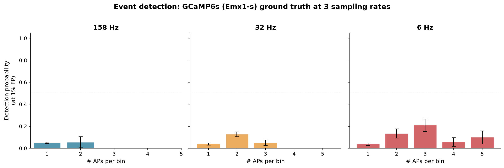
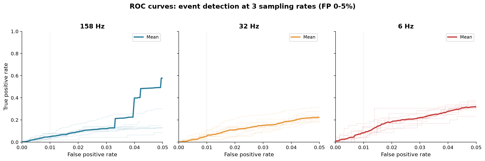
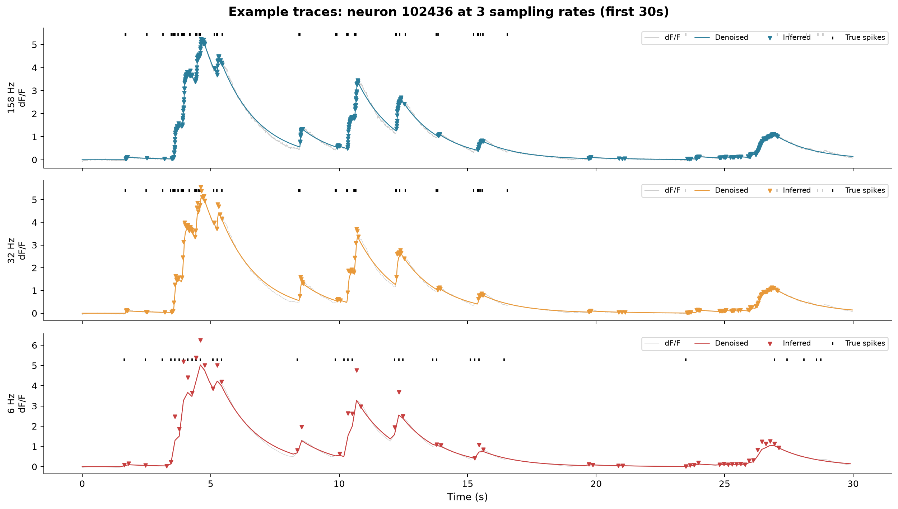
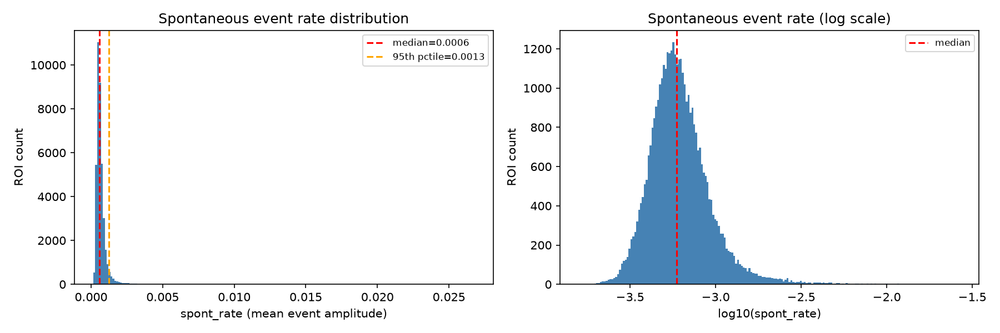
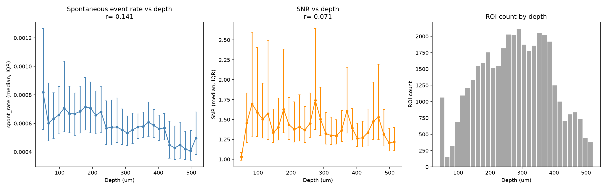
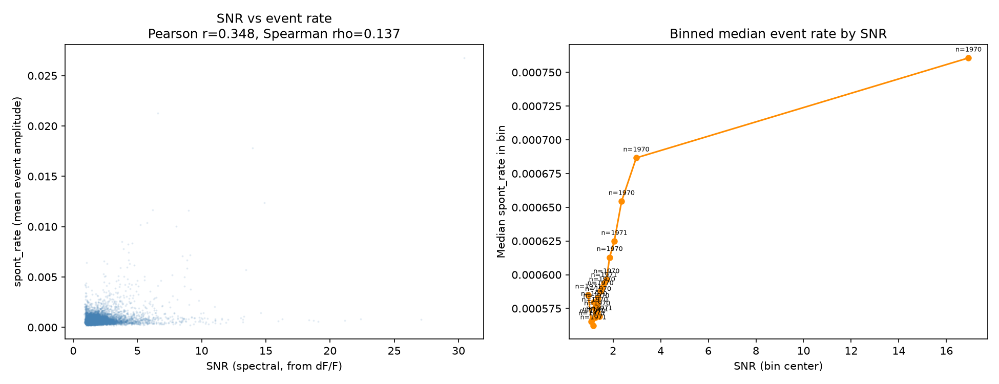
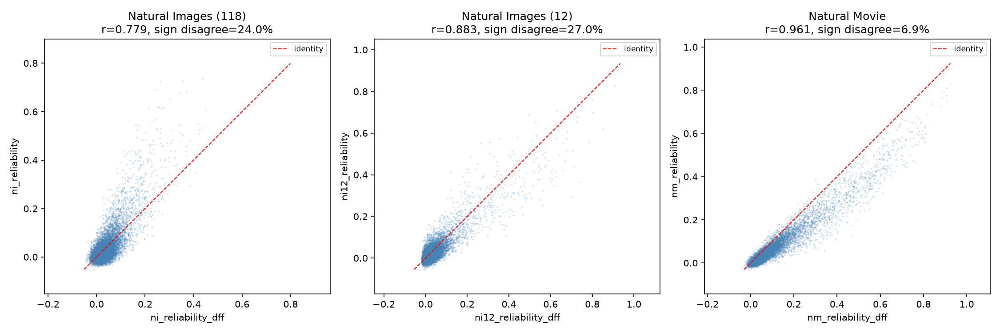

# Events vs dF/F

V1DD images each plane at **6 Hz**. The L0 event inference algorithm
(Jewell & Witten 2018) was validated at 30 Hz. This page records what
we know about event quality at 6 Hz, which trace type each metric
family uses, and the evidence behind each choice.

## The trace-type inversion

The V1DD white paper says:

> Except the receptive field mapping, all the other analysis is performed
> using the df/f traces. For the receptive field mapping, events detected
> by L0-penalized algorithm are used to achieve a more accurate estimation
> of receptive field.

`MetricConfig.trace_type` does the opposite:

| family | pipeline | white paper |
|---|---|---|
| drifting gratings (full and windowed) | events | dF/F |
| natural images (118 and 12) | events | dF/F |
| natural movie | events | dF/F |
| locally sparse noise (receptive fields) | dF/F | events |

This was inherited from `allen_v1dd`; the fork recorded it as a fact about
the original code, not a deliberate divergence. Either the paper's methods
section does not describe the code that produced its figures, or the code
diverged later. This pipeline keeps the inherited assignment and documents
it here.

The evidence below shows that neither "events everywhere" nor "dF/F
everywhere" is correct. Ratio and sparseness metrics require a non-negative
trace; correlations and reliability may be better on dF/F. The assignment
is per-family, as it should be.

## How well does L0 work at 6 Hz?

### Ground truth simulation

10 Emx1-s neurons (GCaMP6s, the same indicator as V1DD's Ai94 line) from
Huang et al. 2021, each with simultaneous cell-attached electrophysiology.
Native fluorescence at ~158 Hz was downsampled to 30 Hz and 6 Hz, and OASIS
AR(1) deconvolution was run at each rate with automatic gamma and lambda
estimation. Detection probability measured at 1% false positive rate:

| APs per bin | 158 Hz | 30 Hz | 6 Hz |
|---|---|---|---|
| 1 | 0.050 | 0.039 | 0.037 |
| 2 | 0.056 | 0.127 | 0.135 |
| 3 | — | 0.051 | 0.211 |

At 6 Hz each bin spans 167 ms, so multi-spike events are common and
contribute more signal. Single-spike detection is ~4% at all three rates.

**Sampling rate is not the bottleneck.** This confirms Huang et al.'s
finding: blind spike inference is limited by SNR and the algorithm, not
temporal resolution. Going from 30 Hz to 6 Hz does not substantially
degrade detection. But the absolute numbers are low — L0 at any rate
detects only one in 25 isolated action potentials. Events should be
understood as **burst detectors** at V1DD's operating point.

### What the eLife paper found at 30 Hz (for comparison)

Huang et al. 2021 tested three blind algorithms (NND, L0, MLspike) on
the same neurons downsampled to 30 Hz. At 1% false positive rate,
detection probability was commonly <0.1 for 1 AP across all mouse lines,
increasing approximately linearly to ~0.8 for 5 APs. Performance was
"similar across mouse lines, with only modest differences between
algorithms." Our simulation numbers are consistent with this.

Ground-truth-optimized detection (using known spike times to tune
thresholds) performed much better — 0.32 for 1 AP in GCaMP6s at 30 Hz —
but that scenario does not apply to V1DD, where spike times are unknown.

### V1DD calcium indicator

V1DD mice are Slc17a7-IRES2-Cre;Camk2a-tTA;Ai94(TITL-GCaMP6s). The
relevant ground truth comparison is Huang et al.'s Emx1-s line (also
Ai94, also GCaMP6s, same layer), which is what the simulation above uses.

### Caveats on the simulation

- OASIS implements L1-penalized deconvolution (Friedrich & Paninski 2016),
  not the exact L0 of Jewell & Witten 2018. The eLife paper found all
  three algorithms performed similarly, so the difference is likely small.
- Lambda was estimated automatically from the noise level of each trace.
  The LIMS pipeline uses per-Cre-line parameters derived from paired
  optical/ephys data, which may perform differently.
- 10 neurons is a small sample. The non-monotonic detection at high AP
  counts (4 AP < 3 AP at 6 Hz) reflects noise from small bin counts.

Source: `scratchpad/simulate_6hz.py`, data from
`s3://allen-paper-supplements/huang_published_2021/processed_data/Emx1-s_highzoom/`.

## Diagnostics from the V1DD asset

39,407 ROIs across 25 sessions, 150 planes.

### Spontaneous event rate

`spont_rate` is the mean L0 event amplitude per frame during spontaneous
activity — not a firing rate in Hz. Median 0.000591, spanning
[0.000159, 0.026760]. No ROI has exactly zero. The distribution is
approximately log-normal (median log10 ≈ −3.2).

### Depth dependence

Both event rate and SNR decline with depth: r(depth, spont_rate) = −0.14,
r(depth, SNR) = −0.07. The co-decline is the expected pattern for 2P
imaging — signal weakens deeper, and events track that. The diagnostic
red flag would be event rate flat while SNR varies (suggesting events
detect noise uniformly); that is not what we see.

### SNR vs event rate

Pearson r = 0.35, Spearman rho = 0.14. The bottom-quartile-SNR median
event rate is 0.000572; the top-quartile is 0.000658 (ratio 1.15). Most
ROIs cluster in a narrow SNR range (1.5–4), limiting the dynamic range
of this comparison. High-SNR outliers (SNR > 10) have clearly elevated
event rates, confirming the correlation is real but weak.

### Reliability: events vs dF/F

Three families ship both `*_reliability` (from events) and
`*_reliability_dff` (from dF/F):

| family | Pearson r | sign disagree | events < dF/F |
|---|---|---|---|
| natural images (118) | 0.779 | 24.0% | 89% |
| natural images (12) | 0.883 | 27.0% | 78% |
| natural movie | 0.961 | 6.9% | 58% |

Events-based reliability is systematically lower than dF/F and compressed
toward zero. The sign disagreement for natural images means roughly a
quarter of ROIs switch from "positively reliable" to "negatively reliable"
(or vice versa) depending on the trace type.

The natural movie's better agreement likely comes from its longer response
window: 3 imaging frames vs 2 for natural images. With 2 frames, a missed
event on one frame halves the trial's response, dominating the correlation
across trials.

Source: `scratchpad/event_diagnostics.py`.

## Which trace each metric should use, and why

### Metrics that require events (non-negative trace)

**Ratio indices: OSI, DSI, GOSI, run_mod_\*.** `(a − b) / (a + b)` on
a signed trace is unbounded when the denominator passes through zero and
inverts sign when both terms are negative. A suppressed cell that is
less suppressed during running scores negative `run_mod` — a sign flip
that makes the metric answer a different question. Events, being
non-negative, eliminate this. The formula's valid range on events is
[−1, 1]; on signed dF/F it is (−∞, +∞).

**Lifetime sparseness.** The Vinje & Gallant form assumes non-negative
responses. On signed data, negative terms violate the formula's
derivation and can push the result outside [0, 1]. See
[comparability.md](comparability.md) for the condition-mean convention.

**Preferred response amplitudes.** `ni_pref_response`, `nm_pref_response`,
and `dgw_pref_dir_mean_response` are most interpretable as non-negative
magnitudes. A negative preferred response on dF/F means the neuron's
strongest response is a suppression, which is valid but changes the
interpretation of downstream uses (e.g. the binomial test on
`frac_responsive_trials`).

### Metrics that could use dF/F

**Reliability** (correlation between trial repeats). The reliability
comparison above shows dF/F gives systematically higher values with
a 0.78–0.96 correlation to events-based reliability. Since reliability
is a Pearson correlation — no denominator, no ratio — it is
mathematically safe on a signed trace. dF/F may actually be more
informative here: events' zero-inflation (from missed single spikes)
adds trial-to-trial variance that is detector noise rather than neural
variability.

**SNR, signal_power, noise_power.** These are spectral measures of the
dF/F trace and are already computed from dF/F regardless of the
`trace_type` setting.

**run_corr_dff.** Already computed from dF/F. A correlation has no
denominator, so the sign instability that makes `run_mod_*` events-only
does not apply.

### Metrics where the choice matters less

**Receptive fields.** The white paper specifies events for RF mapping.
The pipeline uses dF/F. The RF maps are thresholded binary fields at a
coarse 9.3° grid, so the trace choice affects the amplitude of the
response at each position but not the spatial pattern above threshold.
On the other hand, the white paper's reasoning — that events give "a
more accurate estimation of receptive field" — is plausible because
L0's sparsity penalty rejects small fluctuations that might produce
false RF pixels.

**Responsiveness fractions.** `frac_responsive_trials` depends on the
trace type through the bootstrap test, but the threshold
(`dg_frac_thresh = 0.50`) was calibrated against the white paper's
headline responsiveness rate and moving to dF/F would change that
calibration without new evidence.

## The zero-inflation problem

At 6 Hz with 2-frame response windows, the median fraction of natural
images eliciting exactly zero response per ROI is **63%**. This is where
the burst-detection characteristic of L0 intersects the stimulus design:
a neuron that fires 1–2 spikes to an image has a ~96% chance of that
event being missed per frame, so across 2 frames the probability of
detecting at least one event is roughly 1 − 0.96² ≈ 8%. The remaining
92% of presentations register as zero.

This makes ratio metrics fragile (a near-zero denominator from sparse
responses), sparseness values high (most of the response vector is
structural zeros from the detector, not biological selectivity), and
trial-to-trial correlations noisy (events add binomial detection noise
on top of neural variability).

The 63% zero rate is not implausible as biology — V1 neurons are
selective and many images fall outside a cell's receptive field — but
the ground truth simulation shows it is at least partly detector
artefact. The natural movie, with a 3-frame window and continuous
temporal structure, has much less zero-inflation and correspondingly
better events-vs-dF/F agreement (7% sign disagreement vs 24%).

## Summary table

| metric family | trace used | trace recommended | reason |
|---|---|---|---|
| OSI, DSI, GOSI | events | **events** | ratio index, unbounded on signed trace |
| lifetime sparseness | events | **events** | formula requires non-negative inputs |
| run_mod_* | events | **events** | ratio index |
| preferred response | events | **events** | interpretability as magnitude |
| reliability | events | **either** | dF/F gives higher values, no ratio |
| SNR / spectral | dF/F | **dF/F** | defined on fluorescence trace |
| run_corr_dff | dF/F | **dF/F** | correlation, no denominator |
| receptive fields | dF/F | **either** | white paper says events; see text |
| responsiveness | events | **events** | calibrated threshold |

No change to `MetricConfig.trace_type` is recommended. The current
assignment — events for everything except RF — is defensible for the
metrics that require non-negative inputs. The reliability comparison
shows that events-based reliability is systematically lower but
correlated, and the dF/F version is already shipped alongside it for
users who prefer it.

## References

- Huang, Ledochowitsch et al. (2021). Relationship between simultaneously
  recorded spiking activity and fluorescence signal in GCaMP6 transgenic
  mice. *eLife* 10:e51675.
- Jewell & Witten (2018). Exact spike train inference via l0 optimization.
  *Annals of Applied Statistics* 12(4):2457–2482.
- Friedrich & Paninski (2016). Fast active set methods for online spike
  inference from calcium imaging. *NIPS*.
- de Vries, Lecoq, Buice et al. (2020). A large-scale standardized
  physiological survey reveals functional organization of the mouse
  visual cortex. *Nature Neuroscience* 23:138–151.
- Abbasi-Asl et al. (2019). V1DD white paper v6.
