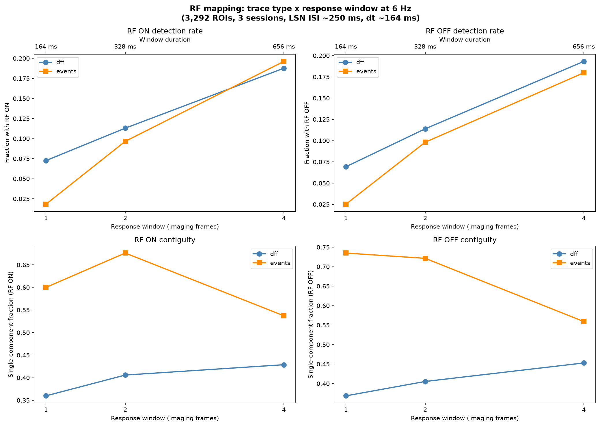

# RF response window and trace type

The receptive field pipeline inherited `lsn_response_frames=4` and `trace_type=dff` from
the 30 Hz Brain Observatory pipeline. Both are wrong at 6 Hz. This page records the
comparison that led to switching to **events, 2 frames**.

## The smearing problem

The locally-sparse-noise stimulus presents a new random pattern every ~250 ms. At 30 Hz,
4 imaging frames = 133 ms — comfortably within one stimulus presentation. At 6 Hz (dt
~164 ms), the same frame count spans 656 ms = **2.6 consecutive stimulus presentations**.
Each sweep response therefore averages neural activity driven by the target pattern and the
next two patterns. Because consecutive LSN frames are spatially uncorrelated by design, the
contamination acts as broadband noise on the fraction map.

| frames | window (6 Hz) | LSN presentations spanned | contamination |
|---|---|---|---|
| 1 | ~164 ms | 0.66 | none; may miss calcium peak |
| 2 | ~328 ms | 1.31 | mild (~30% next-stimulus overlap) |
| 4 | ~656 ms | 2.62 | severe (response spans 2.6 patterns) |

## Comparison design

`code/validation/rf_trace_comparison.py` runs 2 trace types × 3 window widths = 6
conditions on every plane with both dF/F and events traces available. Metrics:

- **Detection rate** (`has_rf`): fraction of ROIs with at least one above-threshold pixel.
- **Single-component fraction**: among ROIs with a detected field, what fraction has
  exactly one connected component (i.e. a contiguous blob, not scattered pixels).
- **Largest-component fraction**: median fraction of above-threshold pixels belonging to
  the largest connected component.

The comparison ran on 3 sessions (3,292 ROIs). Unthresholded maps for all 6 conditions are
saved in `docs/explorations/rf_comparison_maps.npz` for visual inspection.

## Results

### Detection rate

| condition | RF ON rate | RF OFF rate |
|---|---|---|
| dF/F 1f (164 ms) | 7.3% | 6.9% |
| dF/F 2f (328 ms) | 11.3% | 11.4% |
| dF/F 4f (656 ms) | 18.8% | 19.3% |
| events 1f (164 ms) | 1.8% | 2.5% |
| events 2f (328 ms) | 9.7% | 9.8% |
| events 4f (656 ms) | 19.6% | 18.0% |

Detection rises with window width because wider windows integrate more signal (and more
noise). Events at 1 frame is catastrophically low (60 ROIs) — the deconvolved transient
needs at least 2 frames to register. At 4 frames, dF/F and events converge to ~19%.

### Contiguity (RF ON, among detected fields)

| condition | single-component | median largest frac | mean n_components |
|---|---|---|---|
| dF/F 1f | 36% | 0.500 | — |
| dF/F 2f | 41% | 0.500 | 4.98 |
| dF/F 4f | 43% | 0.622 | — |
| events 1f | 60% | 1.000 | — |
| **events 2f** | **68%** | **1.000** | **2.57** |
| events 4f | 54% | 1.000 | — |

Events 2f is the clear winner on field quality. Two-thirds of detected fields are a single
connected component, and the median largest fraction is 1.0 — when a field is detected, it
is typically one contiguous blob. dF/F fields are fragmented at every window width (median
largest fraction stuck at 0.5).

Events at 4f drops to 54% single-component, confirming that smearing degrades even the
sparser event trace.

### Retention from 4f to narrower windows

Of ROIs with RF ON at 4 frames, how many survive at narrower windows?

| trace | retained at 2f | retained at 1f |
|---|---|---|
| dF/F | 52% | 36% |
| events | 47% | 9% |

The ~50% of 4f detections lost at 2f are disproportionately the fragmented, noisy fields
that survive thresholding only because smearing inflates the fraction map. Events at 1f
loses >90% of detections — the deconvolved transient hasn't risen in a single 164 ms frame.

### Cross-trace agreement

Jaccard overlap of RF ON sets: 0.20 at 1f, 0.43 at 2f, 0.58 at 4f. The two traces
converge as the window widens, consistent with smearing drowning out trace-type differences.

## Decision

**Events 2f** (328 ms, 1.3 LSN presentations):

- Detection rate (~10%) is roughly half of 4f (~19%), but the lost detections are mostly
  fragmented scatter — noise that passed threshold, not real spatial tuning.
- 68% single-component fields vs 43% for the prior default (dF/F 4f).
- L0's sparsity penalty naturally suppresses baseline drift, removing the need for the
  explicit baseline subtraction that dF/F required. With events, the baseline step in
  `receptive_field_metrics` is skipped.
- The V1DD white paper specified events for RF mapping. This brings the pipeline back into
  alignment with the stated method.

The tradeoff is real: fewer ROIs get an RF, but the fields that are detected are
substantially more trustworthy for downstream analysis of retinotopic position.

`MetricConfig` changed: `locally_sparse_noise` trace type from `dff` to `events`,
`lsn_response_frames` from 4 to 2. `REFERENCE_CONFIG` preserves the historical values.

## Outputs

- `docs/figures/evt_rf_window_comparison.png` — summary figure (detection rate and
  contiguity vs window width, by trace type)
- `docs/explorations/rf_trace_comparison.csv` — per-ROI metrics for all 6 conditions
  (3,292 ROIs)
- `docs/explorations/rf_comparison_maps.npz` — unthresholded (n_rois, 2, 8, 14) maps
  for all 6 conditions, plus stimulus grid coordinates

Source: `code/validation/rf_trace_comparison.py`.
